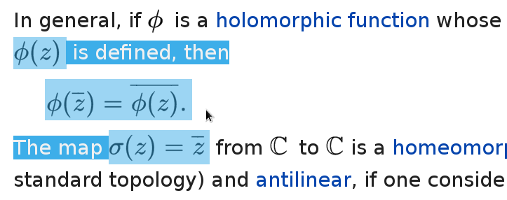
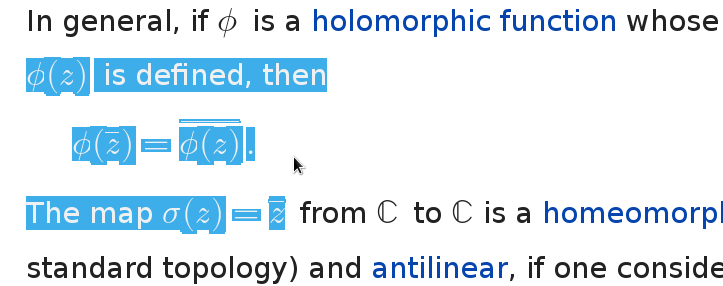

This is a Firefox userstyle that switches the wikipedia math from SVG to
MathML. To apply the userstyle, install the [Stylish][] Mozilla plugin or
similar and install the [userstyle.css](userstyle.css) file into it.

  [stylish]: https://addons.mozilla.org/cs/firefox/addon/stylish/

# Default SVG Math

 

# MathML Math

 
